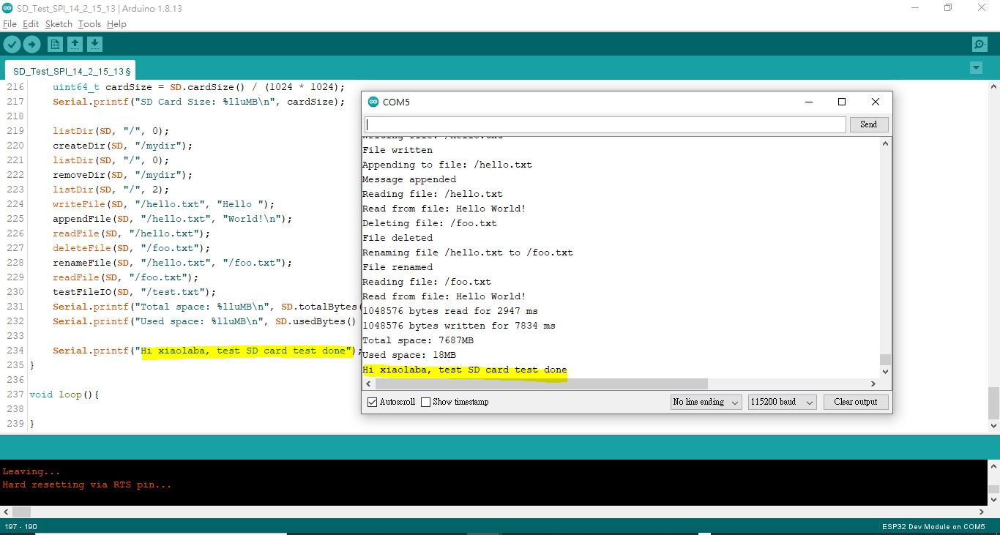
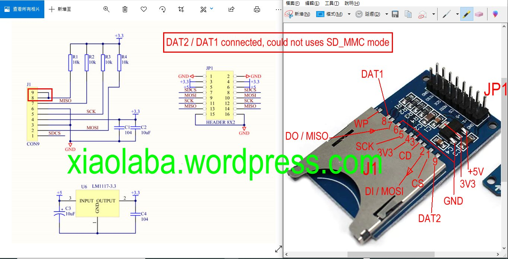
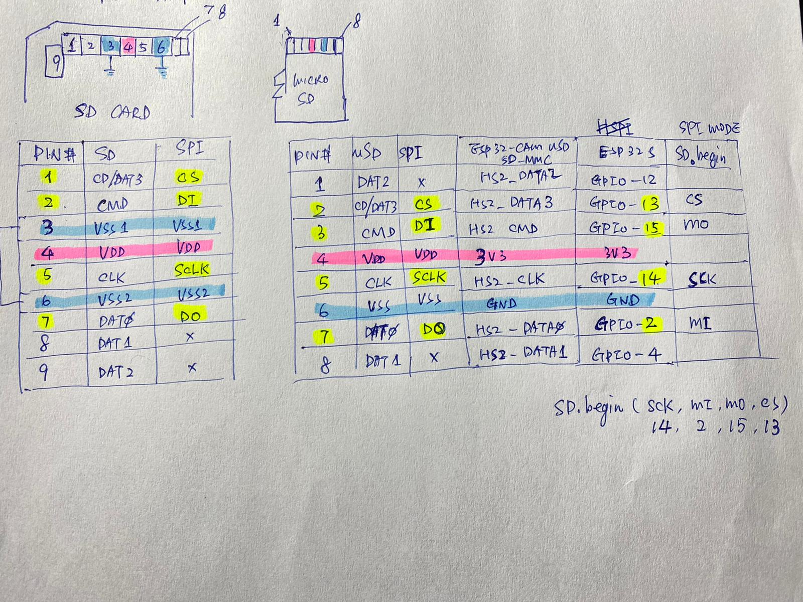
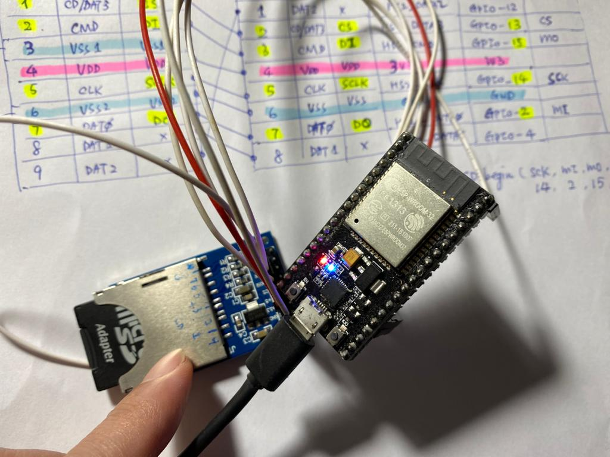
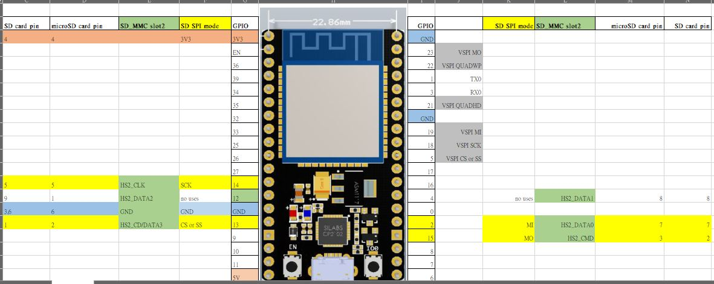
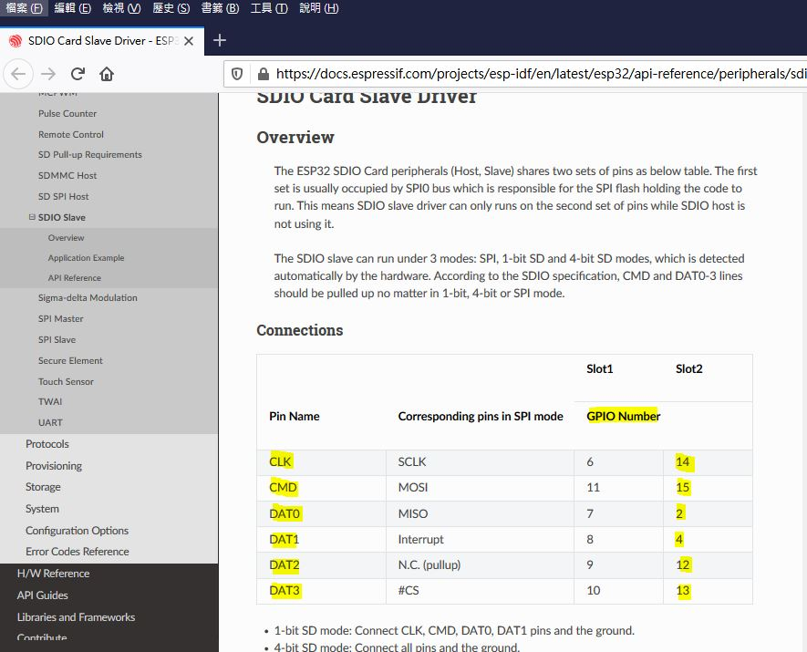
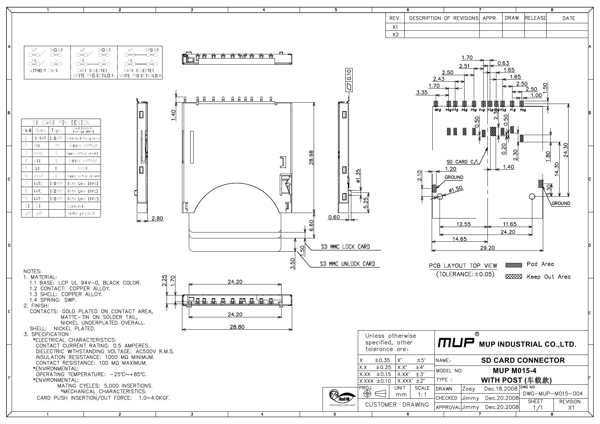
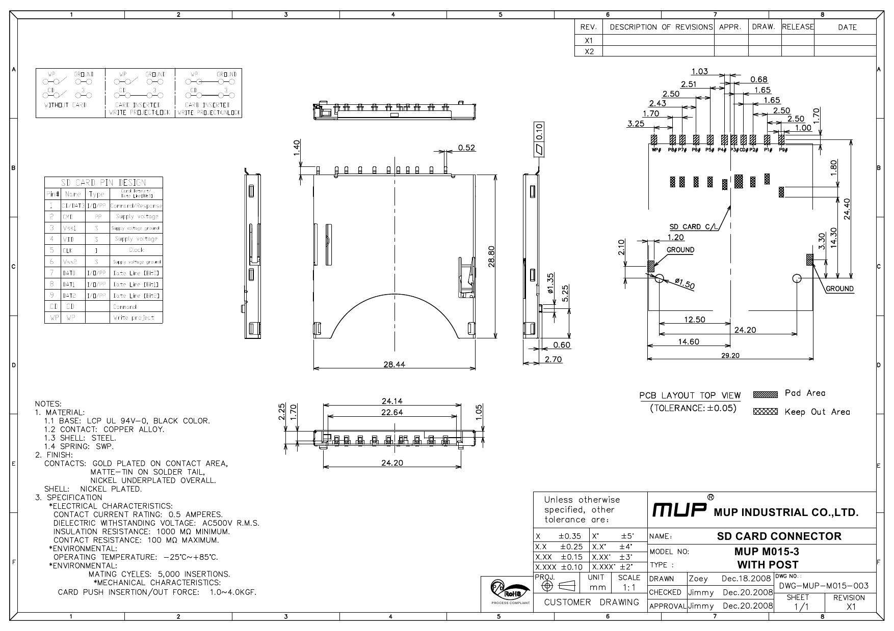
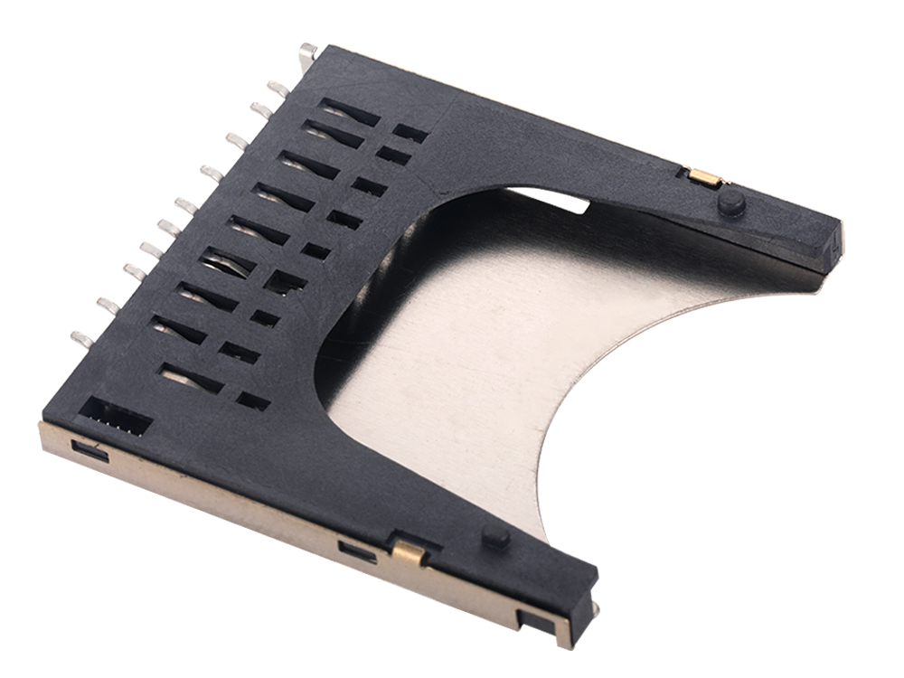

# ESP32_SD_Test_SPI-14-2-15-13  
SD card reader with SPI mode, SCK, MI, MO, CS, GPIO used as 14, 2, 15, 13  

### project file  
[ESP32-S_nodemcu_connection.xlsx](ESP32-S_nodemcu_connection.xlsx)  


the physical connection,
```
/*
 * xiaolaba
 * Connect the SD card or micro SD to the following pins:
 * contact pad is exact the visible sequence
 *
 * SD Card pin name | micro SD card pin name | SPI NAME |ESP32 GPIO
 *    9 DAT2          1 DAT2                   -         -
 *    1 CD/DAT3       2 CD/DAT3                SS/CS     13
 *    2 CMD           3 CMD                    MOSI      15
 *    3 VSS                                    GND
 *    4 VDD           4 VDD                    3V3
 *    5 CLK           5 SCK                    SCK       14
 *    6 VSS           6 VSS                    GND
 *    7 DAT0          7 DAT0                   MISO      2
 *    8 DAT1          8 DAT1                   -         -
 */

#define SCK  14
#define MISO 2
#define MOSI 15
#define SS   13
/*  
 *  // how to, 
    SPI.begin(SCK, MISO, MOSI, SS); //xiaolaba
    SD.begin(SS, SPI);              //xiaolaba
```


the code used for enable this test,
```
void setup(){
    Serial.begin(115200);
    SPI.begin(SCK, MISO, MOSI, SS); //xiaolaba
    if(!SD.begin(SS, SPI)) {        //xiaolaba
//    if(!SD.begin()){              //xiaolaba
        Serial.println("Card Mount Failed");
        return;
}
```


output done,  
  


  



### mistaken and correction









